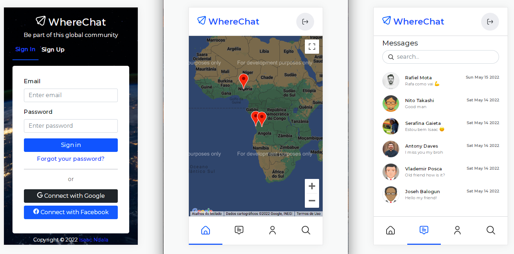

# wherechat


## Table of Contents
* [About the Project](https://github.com/IsaacNdala/wherechat#about-the-project)
* [Built With](https://github.com/IsaacNdala/wherechat#built-with)
* [Live Demo](https://github.com/IsaacNdala/wherechat#live-demo)
* [Project Setup](https://github.com/IsaacNdala/wherechat#getting-started)
* [Author](https://github.com/IsaacNdala/wherechat#author)
* [Contributing](https://github.com/IsaacNdala/wherechat#contributing)
* [License](https://github.com/IsaacNdala/wherechat#license)

## About the project
Wherechat is a chat application that allows users to find and meet each other through their location ond the map.

This is the frontend of the application, the backend can find [here](https://github.com/IsaacNdala/wherechat-backend/).

## Built With
* [Vue.js](https://vuejs.org/)
* [Vuex](https://vuex.vuejs.org/)
* [Google Maps API](https://developers.google.com/maps)
* [Socket.io](https://socket.io/)
* [Axios](https://axios-http.com/)
* [Bootstrap](https://getbootstrap.com/)
* [CSS](https://en.wikipedia.org/wiki/CSS)
* [Javascript](https://en.wikipedia.org/wiki/JavaScript)

## Live Demo
[https://wherechat.herokuapp.com/](https://wherechat.herokuapp.com/)

## Project Setup

1. Clone the repository
```
git clone git@github.com:IsaacNdala/wherechat.git
```

2. Install NPM packages
```
npm install
```


3. Run the application
```
npm run serve
```

## Author
👤 <b>Isaac Ndala</b>

GitHub - [@IsaacNdala](https://github.com/IsaacNdala)</br>
Twitter - [@IsaacNdala11](https://twitter.com/IsaacNdala11)</br>
LinkedIn - [Isaac Ndala](https://www.linkedin.com/in/isaac-ndala)

## Contributing
Pull requests are welcome. For major changes, please open an issue first to discuss what you would like to change.

## License
This project is licensed under the [MIT](https://choosealicense.com/licenses/mit/) License

## Show Some Suport
⭐️  ⭐️  ⭐️

